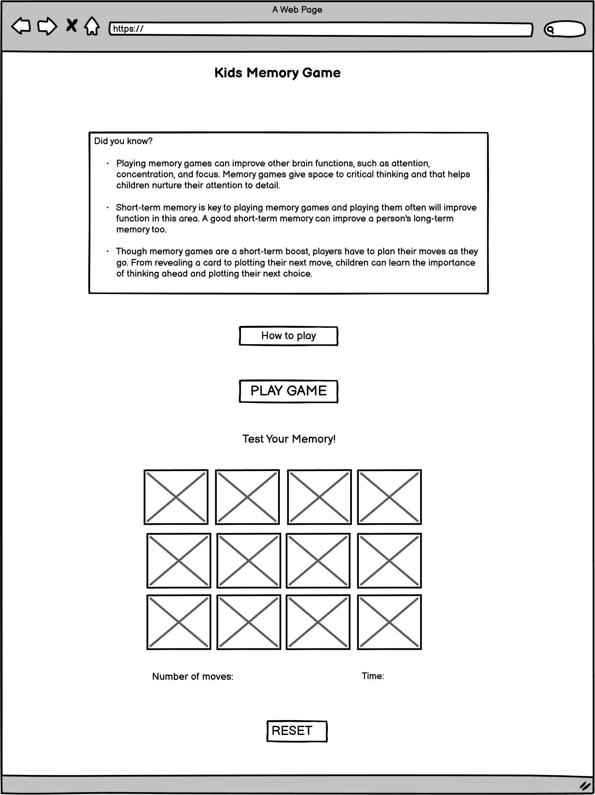
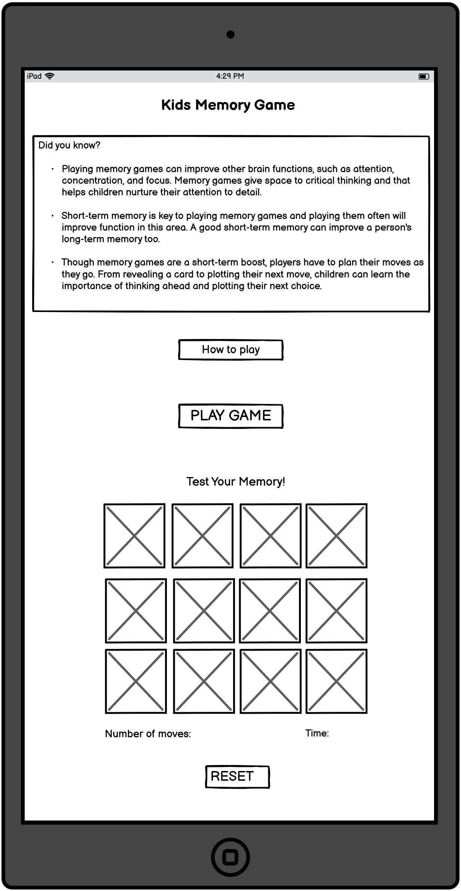
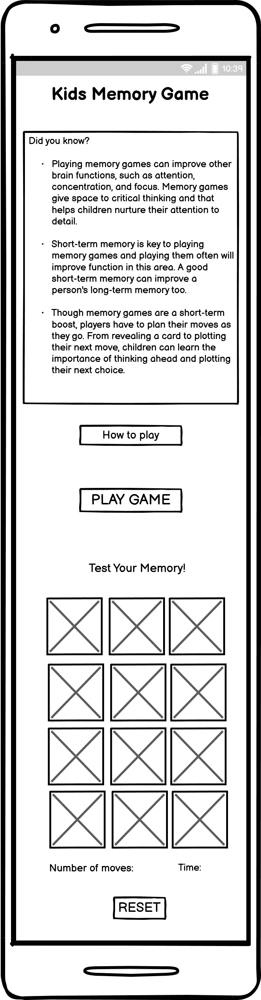

# Kids Memory Game 

representative image

# UX
The inspiration for this game was my daughter. I wanted to make a game that would have a good impact on a child's brain. As a parent I know how hard it is to keep children away from the screen, but sometimes this is inevitable. So I wanted to make a game that would be useful and fun at the same time.
I did a little research on memory games and found out that playing memory games can improve other brain functions, such as attention, concentration, and focus. Memory games give space to critical thinking and that helps children nurture their attention to detail.  
This project is intended for children from 2 -6 years.

## Users Stories 
As a parent:
- I want to make sure the content is applicable to children
- I want my child to easily understand the purpose of the game
- I want my child to have fun while developing memory

As a playes:
- I want to have fun
- I want to see nice and colorful game
- I want to see nice pictures that will keep my atention 
- I want to see my score and moves

#
# Scope 

## Features

- An simple and colofrul page structure so that the user can easily find the game
- "Did you know" section - provides information about the importance of memory game and their impact on children’s memory
- "How to play?" button - provides information about the game rules
- "Play game" button - takes the user to the memory game board
- Memory board - contains 12 cards, the user must find a par for each card
- Number of moves and score - shows the user how many moves have been used for how long
- "Reset" button - user can reset the game and play again

#
# Structure

- **Title**  
    
- **How to play**  
    ...

- **Play**  
    ...

-  **Did you know**  
    ...

# Wireframes

## Desktop View

# Tablet view

# Mobile View

# Surface

## Design 
...

## Chosens Color 

...
 

## Font 

...

## Media

...

# Technologies Used

## Languages 

- [HTML5](https://en.wikipedia.org/wiki/HTML5)
- [CSS3](https://en.wikipedia.org/wiki/CSS)

## Frameworks, Libraries & Programs Used

- [Google Fonts](https://fonts.google.com/https://fonts.google.com/) - provide all of the fonts for this website.

- [Github](https://github.com/IrisSmok) - was used to store the project code.

- [Gitpod](https://www.gitpod.io/) - was used for coding.

- [Balsamiq](https://balsamiq.com/) - was used to create site wireframes.

- [Am I Responsive](http://ami.responsivedesign.is/) - to check if the site is responsive on different screen sizes.

- [Free Online HTML Formatter](https://www.freeformatter.com/html-formatter.html) - was used to correct indentation issues and get rid of too much whitespace

# Testing
- Tested on Chrome, Opera, Microsoft Edge and Firefox desktop version browsers
- Chrome Developer Tools are used to test the responsiveness on: Desktop, Laptop, Moto G4, Galaxy S5, iPhone 5/SE, iPhone 6,7,8, iPhone 6,7,8 Plus, iPad, iPad Pro, Galaxy Fold

# Validating 
The W3C Markup Validator and W3C CSS Validator Services were used to check my code for syntax errors in this project.

- [HTML](https://validator.w3.org/#validate_by_input)- I checked each page by direct input method on HTML validator site

- [CSS](https://jigsaw.w3.org/css-validator/)

- I used Lighthouse tools to test my website

## User Story Testing

### **Testing Users Stories form (UX) Section**

...

 

## Bugs and Issues

...

### **HTML Validator** 

...

### **CSS Validator** 

...

# Final Product 

## Desktop View 
 
...

## Tablet View 
 
 ...

## Mobile View 
 
 ...

# Deployment

## GitHub Pages
1. Log into GitHub and locate the repository.
2. At the top locate the settings option 
3. Scroll towards  the bottom of the page and locate GitHub Pages 
4. Click on the link "Check it out here!"
4. Under 'Source' dropdown, click 'Master' from the options.
5. Click the save button.
6. The site is now published, it may not be available immediately. 
7. The site URL is visible on the green bar under the "Github Pages".

## Github Clone 

1. First you need to install the GitPod Browser Extension.
2. Log into GitHub and locate the repository.
3. Click the green "Gitpod" button just below the Settings.
4. Now you created a new Gitpod workspace from the code in Github

# Credits

## Content

...

...

## Media

....

## Acknowledgements

...
