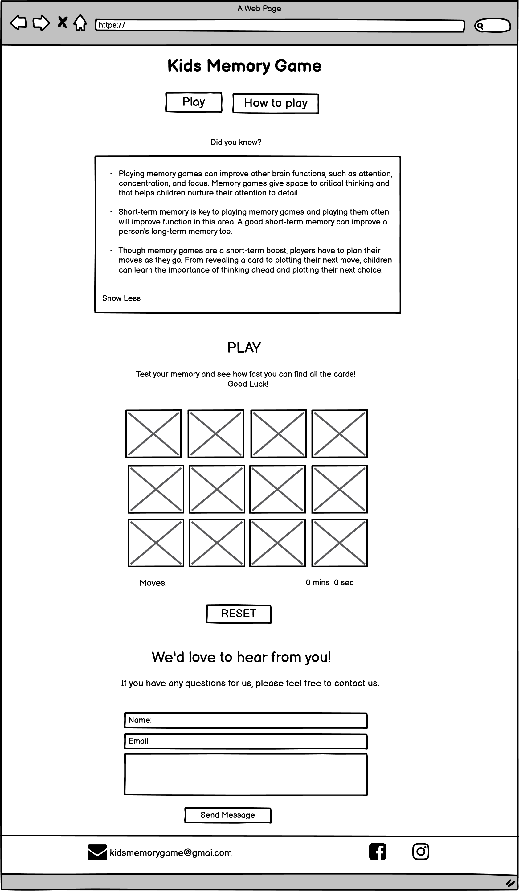
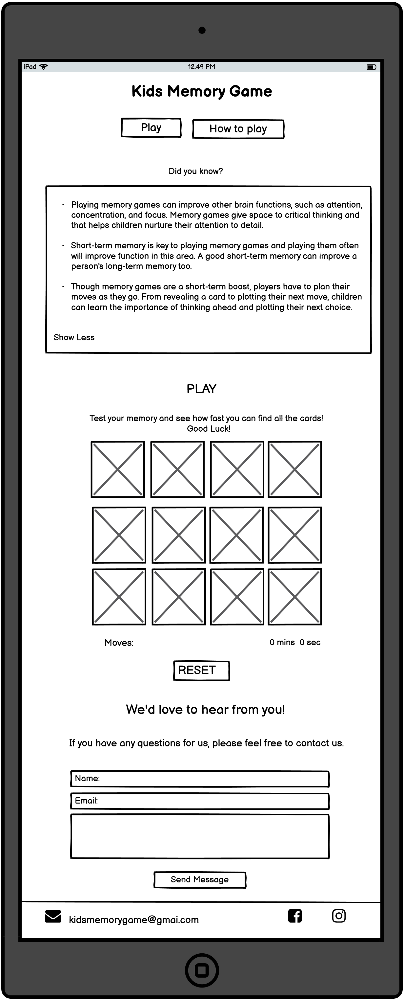
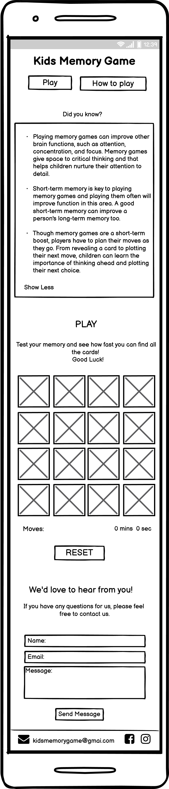
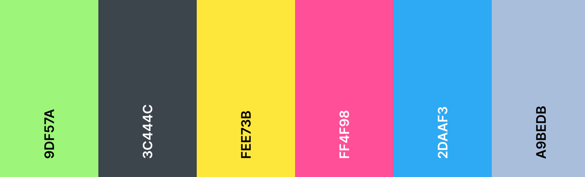

# Kids Memory Game 

representative image

# UX
The inspiration for this game was my daughter. I wanted to make a game that would have a good impact on a child's brain. As a parent I know how hard it is to keep children away from the screen, but sometimes this is inevitable. So I wanted to make a game that would be useful and fun at the same time.
I did a little research on memory games and found out that playing memory games can improve other brain functions, such as attention, concentration, and focus. Memory games give space to critical thinking and that helps children nurture their attention to detail.  
This project is intended for children from 3 - 7 years.

## Users Stories 
As a parent:
- I want to make sure the content is applicable to children
- I want my child to easily understand the purpose of the game
- I want my child to have fun while developing memory

As a player::
- I want to have fun
- I want to see nice and colorful game
- I want to see nice pictures that will keep my atention 
- I want to see my time and moves

#
# Scope 

## Features

- An simple and colorful page structure so that the user can easily find the game
- "Play" button - takes the user to the play section
- "How to play?" button - provides information about the game rules
- "Did you know" section - provides fun facts about the importance of memory game and their impact on children’s memory
- Memory board - contains 16 cards, the user must find a par for each card
- Number of moves and time - shows the user how many moves he has taken in how much time
- "Reset" button - user can reset the game and play again
- "Congratulations Window" - after the user finds all 16 cards, a congratulations window appears showing the moves and time the user has achived
- Contact form - user can contact the game provider if he has questions or suggestions for the game
- Footer - contains mail address and social link

#
# Structure

- **Title**  
    - located at the top of the page

- **Play Button**  
    - located below the title next to the "How to Play" button, takes the user to the game section

- **How to play Button**  
    - located below the title, next to the "Play" button, with a click a window opens that allows the user to read the rules of the game

-  **Did you know**  
    - located bellow buttons, contains fun facts about how memory game affects our memory and brain development 

-  **Play Section**  
    - contains the title and a brief introduction, after wich the game begins. In the play section there is a memory game board which contains 16 cards the user must find a par for each card to win the game. 
    Moves and time - located below game board, shows the user how many moves have been used in how much time

-  **Contact Form**  
    - allows the user to contact the game provider if he has questions or suggestions for the game

 -  **Footer**     
    - contains mail address and social link

# Wireframes

## Desktop View

# Tablet view

# Mobile View

# Surface

# Design 
The design of this site is made in bright and cheerful colors, because they make the page cheerful and positive and the main goal of this page is fun and of course memory training. The site is intended for children from 3 to 7 years, so it's important that the site is colorful and easy to navigate and understand.

It's one page site with two parts.
First part is consist of the title, the short section "Did you know?", a button that opens the game rules and a "Play" button that takes the user to the memory game section.
Second part is consist of the memory game section, contact form and a footer. The memory game section contains the Memory Game board  under which the moves and time are located, the user can see their time and number of moves they used along the way. The user can push the reset button to reset the game and start again. 
When all the pairs are found the congratulations message pop up with final time and moves.

## Chosens Color 

Color palette from Coolors

- #9df57ab5 - body background color. It fits nicely with the background image. The site looks colorful and fun.
- **#3c444c** - the main color. I choose this color because it matches nicely with the rest of the page. The color is neither too dark nor too bright.
- **#fee73bde** - color for play, how to play and reset button. The color is cheerful. That’s why I liked it because it elevates the look of the page.
- **#ff4f98**- color for Play btn. Fits nicely with yellow background. 
- **#2daaf3** - color for How to play text on the button, Reset text and background of Submit.  The color goes well with yellow and pink and gives the page a cheerful look. 
- **deeppink** - color is used for breaf introduction before the board game and title of the contact form. 
- **#a9bedb** - footer background color. I liked the color because it is neither too dark nor too bright. It fits nicely with the whole page and with a submit button.

## Font 
- Cursive, sans-serif - main font
- Indie Flower - for headings and buttons

## Media

**Bacground Image** - covering the first part of the page. It is designed in cheerful colors to make the page cheerful and fun. The picture contains animals as well as the memory game itself. I choose this image because it's childeren firendly and everyone loves animals.

**Memory Game** - the images contain animals, each with a background of a different color which makes game fun and colorful. 

# Technologies Used

## Languages 
- [HTML5](https://en.wikipedia.org/wiki/HTML5)
- [CSS3](https://en.wikipedia.org/wiki/CSS)
- [JS](https://en.wikipedia.org/wiki/JavaScript)

## Frameworks, Libraries & Programs Used

- [Google Fonts](https://fonts.google.com/https://fonts.google.com/) - provide all of the fonts for this website.

- [Github](https://github.com/IrisSmok) - was used to store the project code.

- [Gitpod](https://www.gitpod.io/) - was used for coding.

- [Balsamiq](https://balsamiq.com/) - was used to create site wireframes.

- [Am I Responsive](http://ami.responsivedesign.is/) - to check if the site is responsive on different screen sizes.

- [Free Online HTML Formatter](https://www.freeformatter.com/html-formatter.html) - was used to correct indentation issues and get rid of too much whitespace

# Testing

# Validating 

## User Story Testing

### **Testing Users Stories form (UX) Section**

...

 

## Bugs and Issues

...

### **HTML Validator** 

...

### **CSS Validator** 

...

# Final Product 

## Desktop View 
 
...

## Tablet View 
 
 ...

## Mobile View 
 
 ...

# Deployment

## GitHub Pages

## Github Clone 

# Credits

## Content

...

...

## Media

....

## Acknowledgements

...
